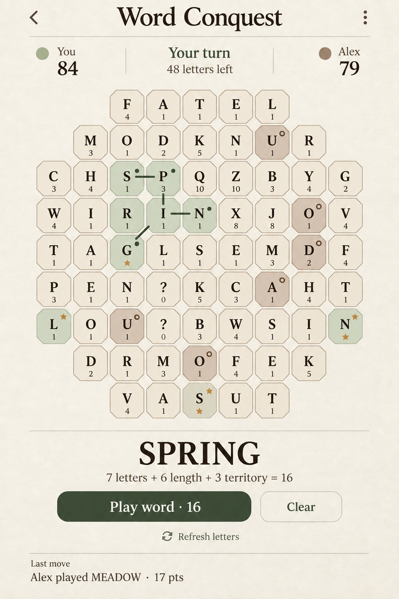

# Approved visual direction: Autumn Sunday

Approved on 29 September 2026. This is the visual reference for future Word Conquest design work.

## Direction

A relaxed Sunday word puzzle with an autumn atmosphere. Emphasize finding satisfying words and friendly competition.

- Warm ivory paper background with subtle texture.
- Sage green player territory and a deeper forest green primary action.
- Soft walnut / milky-coffee brown for the second player, replacing peach and red.
- Dark espresso text, literary serif typography, and understated separators.
- Quiet ochre accents for special tiles.
- Prominent selected word, readable letters, and restrained visual feedback.

This is an approved visual concept, not an exact gameplay specification. Illustrated tile values, paths, score breakdowns, and special-tile positions are placeholders; implementation must use the real game rules. The online client now implements this direction with the 0.3.0 UX revision; see [screen structure and verification](../docs/UX.md). The root local prototype is preserved.

## Identity and copy refinement - 7 October 2026

The WC monogram now combines a curved C and a W; shared vector paths keep web and
Android marks consistent. Keep the warm palette and literary typography, but avoid
table/seat metaphors in product copy. The owner prefers direct, minimal wording.
The game waiting card and You-page Record section have been removed.

## Score animations — concepts for review

The [local score animation gallery](score-animations/index.html) has four offline HTML/CSS/JS prototypes: a score ribbon, a persistent receipt, board-origin points, and a round-end reveal. Each uses the same engine-verified round and has replay, speed, and reduced-motion controls. Option 3 was selected on 6 October and is implemented in the 0.7.0 client; the gallery remains a design reference. See the [prototype notes](score-animations/README.md) and [implementation progress](../docs/PROGRESS.md).

## Reference source

Created with the built-in image generation tool, refining the Paper & Ink concept.

Final refinement prompt:

> Edit this Word Conquest mobile UI concept. Preserve the exact composition, layout, typography, board geometry, all text, letter placements, green territory colors, green button, and fine paper texture. Make a focused palette refinement: replace every peach/apricot/red opponent territory fill and the Alex player color dot with a muted warm walnut/taupe brown, light milky-coffee tile fills with medium earthy walnut outlines and ring markers. Brown must be visibly distinct from cream neutral tiles and sage green tiles, but soft and relaxed, never orange, pink, red or muddy dark. Slightly warm the near-black typography toward very dark espresso brown while maintaining excellent readability. Preserve warm ivory paper and muted ochre stars. Desired mood is a quiet autumn Sunday newspaper word puzzle, understated editorial warmth. No new decorations, leaves, illustrations, objects, UI elements or layout changes. Return the full revised portrait screen.
