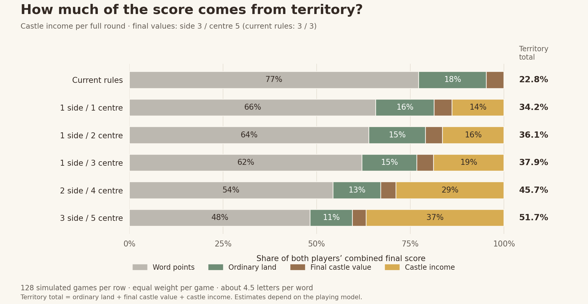

# Castle income and the share of territory points

Across **3,248 new complete simulations and 87,456 turns**, your example—each side castle pays 1 per round, the centre pays 2, final values 3 and 5—made **36.1% of the combined final score come from territory** in the main playing model. Word points supplied 63.9%. Recurring castle income alone supplied 16.4%.

This is a useful, moderate setting to try. Raising the recurring rates to side 2 / centre 4 moved territory to 45.7%; side 3 / centre 5 moved it to 51.7%. My recommendation from this focused experiment is to human-test **1 / 2 income** and **2 / 4 income**, keeping final castle values at 3 / 5. These recommendations are design judgments, not measurements of enjoyment.

No production rules, APK, backend, online games, accounts or services changed. This is a separate follow-up to the [broader study](BALANCE-2026-10-04.md), with different income timing and differentiated castle values.

## What a round and a territory point mean

A round is **one turn by each player**. In the main experiment, after player 2 finishes, both players simultaneously collect income for the castles they then own. This includes the final round. A newly captured castle can pay at that boundary; an unowned castle cannot. Income already earned stays with its earner if the castle is lost later.

The final ownership score is ordinary land at 1 point per tile, plus each owned side castle at its configured final value and the centre at its configured final value. Castle values replace the ordinary tile value; they are not an additional bonus on top of it.

**Territory share = (ordinary land + final side-castle value + final centre-castle value + accumulated side income + accumulated centre income) / total score.**

For each game, the denominator is both players' combined final score. The tables average these per-game fractions equally. This avoids counting an enemy's lost territory as newly created points, or counting capture points repeatedly. The JSON also contains the ratio of all pooled territory points to all pooled scores; it is slightly different (36.3% for your example).

Board, letter distribution, six jokers, five castle positions, 120 shared letters, word bonuses and unlimited captures remain the current defaults. There are **four side castles and one centre castle**. Therefore side-rate increases can matter more than the same increase to the one centre castle.

## Main comparison

Each row contains **128 games: 64 board seeds, each paired with its horizontal mirror**. Both players use the same balanced policy, with eight sampled familiar word choices per turn and all discovered legal routes for those words. The example averages 4.49 letters per word and 13.88 rounds.

| Configuration | Income side / centre per round | Final side / centre | Words | Final ownership | Castle income | All territory |
|---|---:|---:|---:|---:|---:|---:|
| Current rules | 0 / 0 | 3 / 3 | 77.2% | 22.8% | 0.0% | **22.8%** |
| Final values only | 0 / 0 | 3 / 5 | 76.8% | 23.2% | 0.0% | **23.2%** |
| Centre only | 0 / 1 | 3 / 5 | 74.0% | 22.5% | 3.5% | **26.0%** |
| Equal income | 1 / 1 | 3 / 5 | 65.8% | 20.3% | 13.9% | **34.2%** |
| Your example | 1 / 2 | 3 / 5 | 63.9% | 19.7% | 16.4% | **36.1%** |
| Stronger centre | 1 / 3 | 3 / 5 | 62.1% | 19.1% | 18.8% | **37.9%** |
| Stronger sides | 2 / 3 | 3 / 5 | 55.8% | 17.2% | 27.0% | **44.2%** |
| Double example income | 2 / 4 | 3 / 5 | 54.3% | 16.8% | 28.9% | **45.7%** |
| High income | 3 / 5 | 3 / 5 | 48.3% | 14.9% | 36.8% | **51.7%** |
| Lower final values | 1 / 2 | 1 / 3 | 66.5% | 17.4% | 16.1% | **33.5%** |
| Higher final values | 1 / 2 | 5 / 8 | 61.6% | 22.0% | 16.4% | **38.4%** |
| Income with no final castle value | 1 / 2 | 0 / 0 | 68.7% | 15.9% | 15.4% | **31.3%** |

Final ownership combines ordinary land and final castle values. Percentages can differ by 0.1 due to rounding.

For your example, the mean game produced about **283 total points across both players**: 180 word points, 43 ordinary-land points, 13 final castle points and 47 recurring castle points. That last category divides into about 30 from side castles and 17 from the centre. In percentage terms, ordinary land contributed 15.1%, final castles 4.6%, side income 10.5% and centre income 5.9%.

Changing only final castle values has a smaller effect than changing recurring income. Keeping income at 1 / 2, final values of 1 / 3, 3 / 5 and 5 / 8 yielded 33.5%, 36.1% and 38.4% territory respectively. There is no need to sharply increase both at once to give territory substantial weight.

## Variation between games

These are model estimates, not promises about any individual match.

| Configuration | Mean territory share | 95% interval for simulated mean | Middle 90% of game shares |
|---|---:|---:|---:|
| Current rules | 22.8% | 22.3%–23.2% | 18.6%–26.1% |
| Your example | 36.1% | 35.3%–36.9% | 29.0%–42.3% |
| Double example income | 45.7% | 44.7%–46.6% | 35.6%–53.0% |
| High income | 51.7% | 50.7%–52.7% | 41.5%–58.9% |

Intervals resample the 64 seed clusters, keeping mirrors together, using 2,000 bootstrap samples. They measure simulation sampling uncertainty; they do not cover uncertainty about human behaviour. No correction for multiple comparisons is applied.

## Longer words and different playing styles

Longer words earn more word points and exhaust the shared letter budget in fewer rounds. Both effects reduce the fraction of points coming from castle income. The exhaustive familiar-word model is a deliberately strong search model, not a claim about typical expert humans.

| Income side / centre | Main territory share | Exhaustive-search territory share | Main income share | Exhaustive-search income share |
|---|---:|---:|---:|---:|
| 0 / 0 | 22.8% | 11.8% | 0.0% | 0.0% |
| 1 / 1 | 34.2% | 16.2% | 13.9% | 4.6% |
| 1 / 2 | 36.1% | 17.8% | 16.4% | 6.1% |
| 2 / 4 | 45.7% | 22.3% | 28.9% | 11.5% |
| 3 / 5 | 51.7% | 26.4% | 36.8% | 16.0% |

Exhaustive rows have 48 games each from a separate paired-seed set. Your example then averaged **8.05 letters per word and 8.04 rounds**, versus 4.49 and 13.88 in the main model. Its territory share fell from 36.1% to 17.8%. The word lengths in your previously supplied match averaged about 5.4; neither model has been calibrated to your play. Do not interpolate a precise prediction from these two artificial endpoints.

A separate 960-game opponent-style study retained the limited-attention vocabulary. Your example yielded 33.2% territory against a words-first opponent, 37.0% against a tempo opponent, and 35.8% against a castle-focused opponent. Each matchup contains 64 games with policy seats reversed in the mirror.

The balanced policy scored 70.3% wins (draws count half) against words-first under your example, versus 51.6% in the current-rules control. This suggests that noticing territory becomes more useful in this model. It does not prove that the move heuristic is optimal. The tempo opponent, which favours immediate estimated score per letter, did not dominate: balanced won 73.4% under your example and 65.6% under double income.

## Requiring a complete round of ownership

The second timing rule pays only if a castle stayed with the same player continuously since the previous round boundary. Capturing, losing or recapturing it breaks that condition. It cannot pay in its capture round. Final ownership values stay 3 / 5.

| Income side / centre | Own at payout boundary | Hold uninterrupted for a full round | Full-round castle income share |
|---|---:|---:|---:|
| 1 / 1 | 34.2% | 32.4% | 11.6% |
| 1 / 2 | 36.1% | 33.9% | 13.6% |
| 2 / 4 | 45.7% | 42.2% | 24.4% |
| 3 / 5 | 51.7% | 47.7% | 31.6% |

These use the same 64 paired seeds as the main study. Your example changes from 36.1% territory / 16.4% income to **33.9% territory / 13.6% income**. This is a modest reduction, so the timing can be chosen for the intended defensive feel rather than for a huge change in the score budget.

The earlier broad study used uninterrupted ownership. Its uniform castle-income results therefore should not be read as direct measurements of this new side/centre example.

## What happened to the play

| Metric | Current rules | Income 1 / 2 | Income 2 / 4 | Income 3 / 5 |
|---|---:|---:|---:|---:|
| Turns that attack enemy territory | 42.9% | 44.4% | 45.6% | 45.5% |
| Castle ownership changes per game | 3.06 | 4.08 | 4.66 | 4.86 |
| Words giving up at least two available word points | 13.1% | 17.0% | 19.7% | 20.3% |
| Halfway leader eventually wins | 72.4% | 75.4% | 78.6% | 80.2% |
| First-player win share, draws half | 44.1% | 41.8% | 37.5% | 34.4% |

The bots fight over castles more frequently, and are more willing to give up word points. Total attack frequency changes less. This is consistent with focused castle contests, rather than every tile becoming equally valuable.

The higher-income rows also show larger leads and fewer reversals: the halfway leader won about 72% under current rules, 75% under your example and 80% under high income. These are descriptive associations, not proof that income alone causes an irreversible early lead.

There is a seat-balance warning. First-player wins fell from 44.1% in the main control to 41.8%, 37.5% and 34.4% as income rose. Corresponding 95% cluster-bootstrap intervals are 36.3–52.3%, 35.2–48.8%, 28.9–46.1% and 26.6–43.0%. Player 2 gets the last action before each payout and the final ownership tally, but the study does not isolate those mechanisms. Full-round holding did not reliably remove the pattern. Avoid declaring the strongest-income configuration balanced without testing starting-order and payment timing.

Removing income from the already-played score would change the winner or draw status in 18.8% of your-example games and 25.0% of double-income games. That is an accounting observation, not a counterfactual replay: players would make different choices if the rules changed.

## Suggested next experiment

Try your **side 1 / centre 2 income, final 3 / 5** first if you want words to remain the majority of points while castle control is clearly useful. It landed around two-thirds words, one-third territory in the main model.

Use **side 2 / centre 4, final 3 / 5** as the more strategic comparison: it approached an even words/territory split. I would compare these two in human games with alternating starters, rather than dismiss castle income based on the earlier all-tile experiment.

Record whether a lower-scoring word feels worthwhile because it takes or protects a castle, whether an early centre lead remains catchable, and whether moving second feels advantageous. A 50/50 point split is not itself proof of good strategic balance. Hold the board, jokers and word bonuses fixed during this comparison.

## Reproduction and boundaries

The new adapter and runner live in [castle-income/](castle-income/README.md). They import the existing immutable engine and dictionary-derived vocabulary. Each selected word is submitted through the actual engine for path, dictionary, ownership, word scoring and replacement-letter validation. The adapter handles differentiated castle values and payouts, and checks every chosen move's territory swing against before/after ownership scores.

There are 12 primary point configurations and four full-hold timing variants. The stages are 1,536 main games, 960 mixed-policy games, 240 exhaustive-search games and 512 full-hold games. All completed; no search-node-limit cutoff was allowed. Tiny unit-test and determinism games are excluded from those counts.

Nine new research tests and the nine previous research tests pass. Coverage includes unequal castle values, no double counting, simultaneous/final-round payouts, banked income surviving a loss, capture-round timing, recapture breaking a hold, unchanged production baseline, deterministic games and complete-game score conservation.

Search uses the previous study's pinned dictionary intersection and wordfreq 3.1.1 frequency cache, Zipf at least 3.5, maximum word length nine. In the main model, eight unique word types are sampled with weight proportional to 10^(0.35 × (frequency − 3.5)) × exp(−0.7 × (length − 4)); all routes for those words remain eligible. This is a sensitivity model, not measured cognition. See the [vocabulary attribution](balance/README.md#vocabulary-source-and-attribution).

The balanced policy values immediate word points, territory score swing and up to two estimated future castle payments, plus small castle/joker preferences. It does not search opponent replies, future letters or a long defensive plan. The words policy prioritizes word points. Castle-focused doubles the income estimate and halves immediate land weight. Tempo divides estimated score swing by word length and includes the current income advantage. Exact coefficients are in the source. No per-variant tuning was done.

The [result JSON](castle-income-2026-10-04.json) contains all stage parameters, component scores for every game, aggregate statistics, source/cache/dictionary hashes and raw-log hashes. Full local turn logs remain in ignored work/castle-income/. The [chart](castle-income-2026-10-04.svg) is also available as SVG. This documentation-only work incurs no new ongoing cost and does not trigger an APK build.
